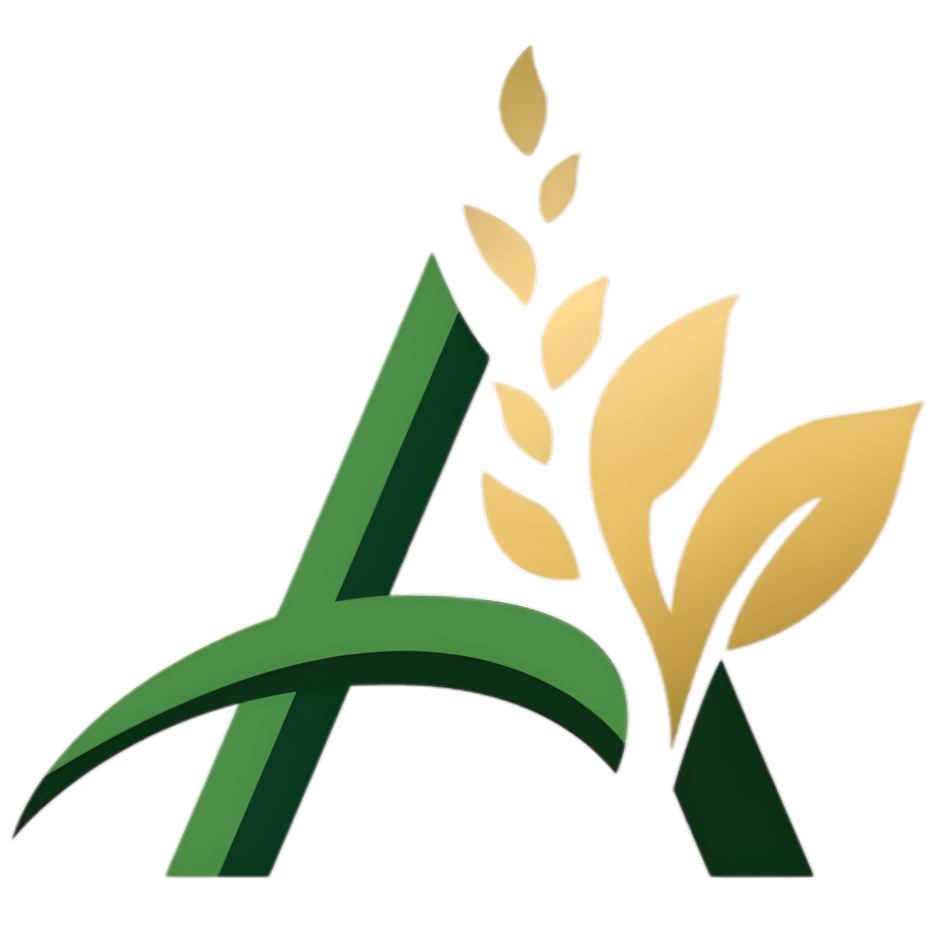

<div align="center">
  
  <h1>Agrolytics: Precision Agriculture Redefined</h1>

  <p>
    <strong>AI-powered crop management, hyperlocal telemetry, and market intelligence for sugarcane farmers in Maharashtra.</strong>
  </p>

  <p>
    <a href="https://agrolytics-gules.vercel.app/" target="_blank">
      
    </a>
  </p>
  
  <div>
    
    
    
    
    
    
  </div>
</div>

<br />

## 🌟 The Elevator Pitch
**Agrolytics** bridges the gap between traditional Indian farming and modern precision agriculture. Built specifically for sugarcane cultivation, this platform aggregates complex datasets (satellite NDVI, weather grids, and historical crop data) and distills them into actionable, locally-translated intelligence (Marathi/Hindi). 

Our goal is simple: empower farmers to maximize their yield, prevent crop failure, and predict local market rates—all wrapped in a premium, glassmorphism-inspired UI that feels like a modern SaaS product.

---

## 📸 Platform Highlights

### 1. The Command Center (Farmer Dashboard)
A bespoke, multilingual dashboard that gives farmers a birds-eye view of their fields. Features dynamic pie charts for crop varieties and actionable top-level metrics.
<br />


### 2. Deep Prediction Intelligence (Machine Learning Integration)
Drill down into specific fields to reveal machine-learning predictions. Compare estimated yields against regional benchmarks, predict local crop market prices, and optimize harvesting windows based on moisture risks.
<br />
<div align="center">
  
  
</div>

### 3. AgroAI Chatbot (Native LLM Integration)
A custom AI assistant mapped to Google's **Gemini 2.5 Flash Lite** model. It automatically detects if a farmer writes in English, Hindi, or Marathi, and responds fluently in the same language. 
<br />


---

## 🛠️ Technical Architecture

This application was engineered with a focus on **Decoupled State Management**, **Performance**, and **Deep Localization**.

### Tech Stack Choices:
* **Frontend Framework:** React 18 + Vite (for rapid HMR and optimized production bundles).
* **Styling Strategy:** **Vanilla CSS** + CSS Variables. Instead of relying heavily on Tailwind, we built custom animations, gradients, and a bespoke glassmorphism design system from scratch.
* **Backend & Auth:** **Supabase** handles row-level-security (RLS) PostgreSQL database instances and real-time user authentication.
* **Localization (i18n):** Implemented `react-i18next` for seamless state-driven translations across English, Hindi, and Marathi without page reloads.
* **Data Visualization:** Utilized **Recharts** (`<ResponsiveContainer>`, `<PieChart>`, `<LineChart>`) for highly interactive, fluid SVGs mapped to our dynamic JSON datasets.
* **AI Engine:** Real-time completion streaming using **Google Gemini API** (`v1beta/models/gemini-2.5-flash-lite`), engineered with a system prompt optimized for agricultural compliance and strict language mirroring.

---

## 💡 Why This Project Stands Out

For engineering recruiters and technical hiring managers reviewing this repo, here is what sets Agrolytics apart from a standard CRUD application:

1. **Complex Routing & State Delegation:** 
   We manage a deep component tree (`FarmerDashboard` > `FieldDetails` > `PredictionPanel`) while hydrating state via Supabase async calls and local caching.
2. **Production-Ready i18n:**
   The language toggle is completely integrated. We modularized translation dictionaries (`en.json`, `mr.json`, `hi.json`) ensuring scalability for more regions natively.
3. **Advanced CSS Mastery:**
   Instead of falling back on UI component libraries, we hand-crafted complex responsive grids, floating action buttons (FABs), pulsing animations, and theme-adaptive glow orbs using standard CSS3.
4. **Resilient AI Error Handling:**
   The `AgroChat` component doesn't just call an API; it formats chat history, handles network timeout states gracefully (`[isLoading] = true`), scrolls cleanly into view with `useRef()`, and dynamically alters its placeholder text based on the global language state.

---

## 🚀 Local Development Setup

Want to run Agrolytics locally? Follow these steps:

**1. Clone the repository**
```bash
git clone https://github.com/your-username/agrolytics.git
cd agrolytics
```

**2. Install dependencies**
```bash
npm install
```

**3. Configure Environment Variables**
Create a `.env` file at the root of the project with the following keys:
```env
VITE_SUPABASE_URL=your_supabase_project_url
VITE_SUPABASE_ANON_KEY=your_supabase_anon_key
VITE_GEMINI_API_KEY=your_gemini_api_key
```

**4. Spin up the dev server**
```bash
npm run dev
```

**5. Build for Production**
```bash
npm run build
```

---

<div align="center">
  <i>"Cultivating the future of farming, one byte at a time."</i>
</div>
